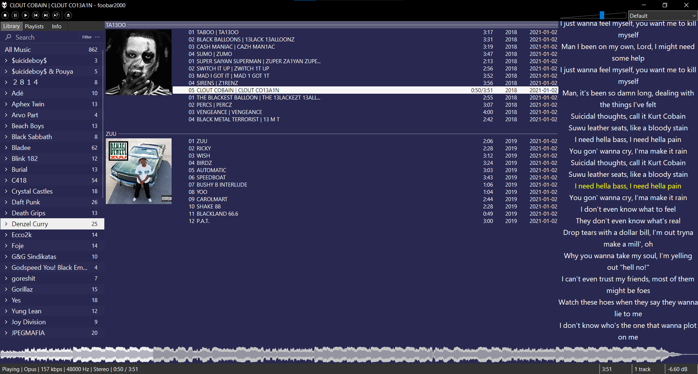

# Okeanic

Okeanic - A clean minimal foobar theme

## Features

- Minimalistic (<50MB RAM Usage)
- Waveform seekbar
- Auto fetching lyrics
- Scalable interface (thanks to Panel Stack Splitter)
- No ugly borders
- last.fm scrobbing

## Installation

Fresh foobar2000 profile highly recommended\
Theme tested on v1.6.10

1. [Download this repo](https://github.com/D221/Okeanic/zipball/main)
2. From zip file copy user-components, theme, foo_spider_monkey_panel and configuration to your profile location:

- Standard installation: %appdata%/foobar2000
- Portable installation: \<your foobar2000 folder>/profile

## Default Shortcuts

|Key|Description|
|-|-|
|Space|Play/Pause |
|Ctrl+Left Arrow|Seek Back 5s|
|Ctrl+Right Arrow|Seek Forward 5s|
|Ctrl+Down Arrow|Volume Down|
|Ctrl+Up Arrow|Volume Up|

## Plugins Credits

[Columns UI by reupen](https://github.com/reupen/columns_ui)\
[Panel Stack Splitter & EsPlaylist by ssenna00](https://foo2k.chottu.net/)\
[Spider Monkey Panel by TheQwertiest](https://github.com/TheQwertiest/foo_spider_monkey_panel)\
[Discogs Tagger by zoomorph](https://bitbucket.org/zoomorph/foo_discogs)\
[OpenLyrics by jacquesh](https://github.com/jacquesh/foo_openlyrics)\
[Playback Statistics by Peter Pawlowski](https://www.foobar2000.org/components/view/foo_playcount)\
[Srobble by gix](https://github.com/gix/foo_scrobble)\
[Waveform Minibar (mod) by Janne Hyvärinen](https://foobar.hyv.fi/?view=foo_wave_minibar_mod)\
[Library Tree by WilB](https://hydrogenaud.io/index.php?topic=110938.msg1001096#msg1001096)
